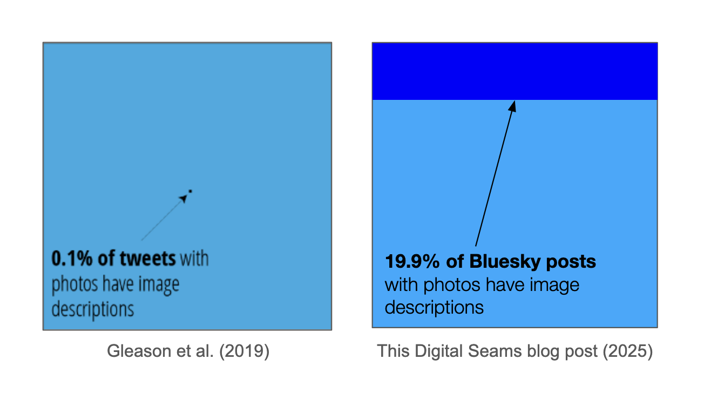

# Bluesky Alt Text

This repo contains code and data about the usage of "alt text" image descriptions on Bluesky.



See the blog post for more information on the project:
[Image descriptions on Bluesky: not bad, could be better](https://digitalseams.com/blog/image-descriptions-on-bluesky?ref=github.com/bobbiec/bluesky-alt-text).
See also the web-based [Bluesky Alt Text Stream](https://bobbiec.github.io/bluesky-alt-text.html) for a streaming view, if you don't need to save the data.

The repo contains two parts:

- Data collection from the Bluesky Firehose (top-level + `src`), in Node
- Analysis of the resulting data, in Python

## Data

The files `image_posts.csv` and `top_100_users.csv` are data collected for this project.

`image_posts.csv` is a collection of 2.8 million Bluesky image posts and their corresponding image descriptions (alt text).
The image description is an empty string if it was not present.
This file was generated using `index.js` (see below, Data colection)
during the period from July 14 to July 21, 2025.

`top_100_users.csv` is a hand-labeled collection of the top users (users with the most posts) in the dataset.
I used this to filter out the most frequently-posting bots from the dataset.

## Data collection

Requirements: `node` - I'm using `v16.15.0` and it's untested on other versions.

To collect data, run the following:

```
node index.js
```

Note this will overwrite the existing `image_posts.csv`.

If you don't need to save the data but just want to view the live activity,
check out the web-based [Bluesky Alt Text Stream](https://bobbiec.github.io/bluesky-alt-text.html) instead.

## Analysis

The `analysis` folder contains Python code for a basic analysis.
See the README in that folder for more info.

## Inspiration

This project is inspired by the 2019 paper [“It's almost like they're trying to hide it”: How User-Provided Image Descriptions Have Failed to Make Twitter Accessible](https://dl.acm.org/doi/10.1145/3308558.3313605),
by Cole Gleason, Patrick Carrington, Cameron Cassidy, Meredith Ringel Morris, Kris M. Kitani, Jeffrey P. Bigham.

See my [blog post for more information](https://digitalseams.com/blog/image-descriptions-on-bluesky?ref=github.com/bobbiec/bluesky-alt-text).
